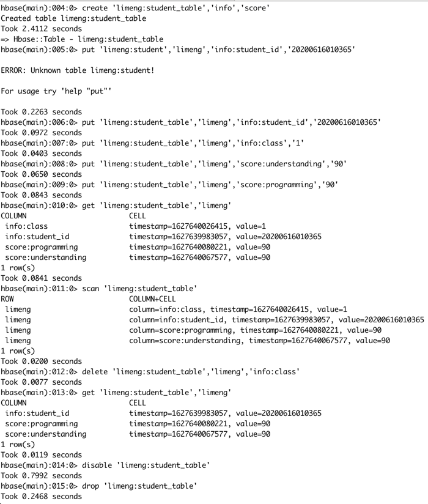

# Hbase

## Hbase Shell 操作



## Java API code
```java
package hbaseOperation;

import org.apache.commons.lang.StringUtils;
import org.apache.hadoop.conf.Configuration;
import org.apache.hadoop.hbase.Cell;
import org.apache.hadoop.hbase.CellUtil;
import org.apache.hadoop.hbase.HBaseConfiguration;
import org.apache.hadoop.hbase.TableName;
import org.apache.hadoop.hbase.client.*;
import org.apache.hadoop.hbase.util.Bytes;
import org.apache.hbase.thirdparty.org.apache.commons.collections4.CollectionUtils;

import java.io.IOException;
import java.util.*;

public class HbaseDemo {
    public static final String ZK_CONNECT_VALUE = "47.101.204.23:2181,47.101.216.12:2181,47.101.206.249:2181";

    // 建立连接
    public static Connection getConnection() {
        try {
            //获取配置
            Configuration config = HBaseConfiguration.create();
            config.set("hbase.zookeeper.quorum", ZK_CONNECT_VALUE);
            Connection connection = ConnectionFactory.createConnection(config);
            return connection;
        } catch (IOException e) {
            throw new RuntimeException(e);
        }
    }

    /**
     * 创建表
     * @param connection
     * @param tableName
     * @param columnFamilies
     * @throws IOException
     */
    public static void createTable(Connection connection, TableName tableName, String... columnFamilies) throws IOException {
        Admin admin = null;
        try {
            admin = connection.getAdmin();
            if (admin.tableExists(tableName)) {
                System.out.printf("table %s exists!", tableName.getName());
            } else {
                TableDescriptorBuilder builder = TableDescriptorBuilder.newBuilder(tableName);
                for (String columnFamily : columnFamilies) {
                    builder.setColumnFamily(ColumnFamilyDescriptorBuilder.of(columnFamily));
                }
                admin.createTable(builder.build());
                System.out.printf("create table %s success!", tableName.getName());
            }
        } finally {
            if (admin != null) {
                admin.close();
            }
        }
    }

    /**
     * 插入数据
     *
     * @param connection
     * @param tableName
     * @param rowKey
     * @param columnFamily
     * @param column
     * @param data
     * @throws IOException
     */
    public static void put(Connection connection, TableName tableName,
                           String rowKey, String columnFamily, String column, String data) throws IOException {

        Table table = null;
        try {
            table = connection.getTable(tableName);
            Put put = new Put(Bytes.toBytes(rowKey));
            put.addColumn(Bytes.toBytes(columnFamily), Bytes.toBytes(column), Bytes.toBytes(data));
            table.put(put);
        } finally {
            if (table != null) {
                table.close();
            }
        }
    }
    /**
     * 根据row key、column 读取
     *
     * @param connection
     * @param tableName
     * @param rowKey
     * @param columnFamily
     * @param column
     * @throws IOException
     */
    public static String getCell(Connection connection, TableName tableName, String rowKey, String columnFamily, String column) throws IOException {
        Table table = null;
        try {
            table = connection.getTable(tableName);
            Get get = new Get(Bytes.toBytes(rowKey));
            get.addColumn(Bytes.toBytes(columnFamily), Bytes.toBytes(column));

            Result result = table.get(get);
            List<Cell> cells = result.listCells();

            if (CollectionUtils.isEmpty(cells)) {
                return null;
            }
            String value = new String(CellUtil.cloneValue(cells.get(0)), "UTF-8");
            return value;
        } finally {
            if (table != null) {
                table.close();
            }
        }
    }

    /**
     * 根据rowkey 获取一行
     *
     * @param connection
     * @param tableName
     * @param rowKey
     * @return
     * @throws IOException
     */
    public static Map<String, String> getRow(Connection connection, TableName tableName, String rowKey) throws IOException {
        Table table = null;
        try {
            table = connection.getTable(tableName);
            Get get = new Get(Bytes.toBytes(rowKey));

            Result result = table.get(get);
            List<Cell> cells = result.listCells();

            if (CollectionUtils.isEmpty(cells)) {
                return Collections.emptyMap();
            }
            Map<String, String> objectMap = new HashMap<>();
            for (Cell cell : cells) {
                String qualifier = new String(CellUtil.cloneQualifier(cell));
                String value = new String(CellUtil.cloneValue(cell), "UTF-8");
                objectMap.put(qualifier, value);
            }
            return objectMap;
        } finally {
            if (table != null) {
                table.close();
            }
        }
    }
    /**
     * 扫描全表
     *
     * @param connection
     * @param tableName
     * @param rowkeyStart
     * @param rowkeyEnd
     * @throws IOException
     */
    public static List<Map<String, String>> scan(Connection connection, TableName tableName, String rowkeyStart, String rowkeyEnd) throws IOException {
        Table table = null;
        try {
            table = connection.getTable(tableName);
            ResultScanner rs = null;
            try {
                Scan scan = new Scan();
                if (!StringUtils.isEmpty(rowkeyStart)) {
                    scan.withStartRow(Bytes.toBytes(rowkeyStart));
                }
                if (!StringUtils.isEmpty(rowkeyEnd)) {
                    scan.withStopRow(Bytes.toBytes(rowkeyEnd));
                }
                rs = table.getScanner(scan);

                List<Map<String, String>> dataList = new ArrayList<>();
                for (Result r : rs) {
                    Map<String, String> objectMap = new HashMap<>();
                    for (Cell cell : r.listCells()) {
                        String qualifier = new String(CellUtil.cloneQualifier(cell));
                        String value = new String(CellUtil.cloneValue(cell), "UTF-8");
                        objectMap.put(qualifier, value);
                    }
                    dataList.add(objectMap);
                }
                return dataList;
            } finally {
                if (rs != null) {
                    rs.close();
                }
            }
        } finally {
            if (table != null) {
                table.close();
            }
        }
    }
    /**
     * 删除表
     *
     * @param connection
     * @param tableName
     * @throws IOException
     */
    public static void deleteTable(Connection connection, TableName tableName) throws IOException {
        Admin admin = null;
        try {
            admin = connection.getAdmin();
            if (admin.tableExists(tableName)) {
                //现执行disable
                admin.disableTable(tableName);
                admin.deleteTable(tableName);
            }
        } finally {
            if (admin != null) {
                admin.close();
            }
        }
    }

    public static void main(String[] args) {
        Connection connection = null;
        try {
            System.out.println("strat~");
            connection = getConnection();
            TableName tableName = TableName.valueOf("limeng:student");

            //创建表
            createTable(connection, tableName, "info", "score");

            System.out.printf("创建表 {}", tableName.getNameAsString());

            //写入数据
            put(connection, tableName, "Tom", "info", "student_id", "20210000000001");
            put(connection, tableName, "Tom", "info", "class", "1");
            put(connection, tableName, "Tom", "score", "understanding", "75");
            put(connection, tableName, "Tom", "score", "programming", "82");

            put(connection, tableName, "Jerry", "info", "student_id", "20210000000001");
            put(connection, tableName, "Jerry", "info", "class", "1");
            put(connection, tableName, "Jerry", "score", "understanding", "85");
            put(connection, tableName, "Jerry", "score", "programming", "67");

            put(connection, tableName, "Jack", "info", "student_id", "20210000000002");
            put(connection, tableName, "Jack", "info", "class", "2");
            put(connection, tableName, "Jack", "score", "understanding", "80");
            put(connection, tableName, "Jack", "score", "programming", "80");

            put(connection, tableName, "Rose", "info", "student_id", "20210000000003");
            put(connection, tableName, "Rose", "info", "class", "2");
            put(connection, tableName, "Rose", "score", "understanding", "60");
            put(connection, tableName, "Rose", "score", "programming", "61");

            put(connection, tableName, "LiMeng", "info", "student_id", "20210000000004");
            put(connection, tableName, "LiMeng", "info", "class", "1");
            put(connection, tableName, "LiMeng", "score", "understanding", "99");
            put(connection, tableName, "LiMeng", "score", "programming", "99");

            System.out.printf("写入数据.");

            String value = getCell(connection, tableName, "row1", "state", "c2");
            System.out.printf("读取单元格-row1.state:%s", value);

            Map<String, String> row = getRow(connection, tableName, "row2");
            System.out.printf("读取单元格-row2:%s", row);

            List<Map<String, String>> dataList = scan(connection, tableName, null, null);
            System.out.printf("扫描表结果-:\n%s", dataList);

            //删除表
            deleteTable(connection, tableName);
            System.out.printf("删除表 %s", tableName.getNameAsString());

            System.out.printf("操作完成.");
        } catch (Exception e) {
            System.out.printf("操作出错", e);
        } finally {
            if (connection != null) {
                try {
                    connection.close();
                } catch (IOException e) {
                    System.out.printf("error occurs", e);
                }
            }
        }

    }

}

```
