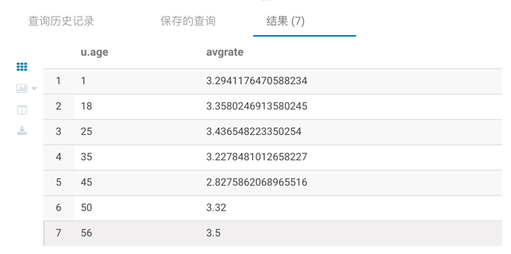
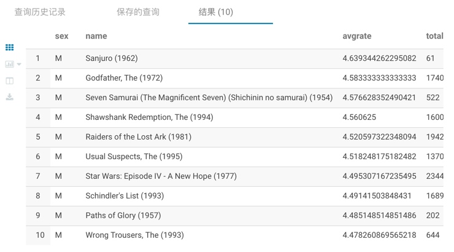
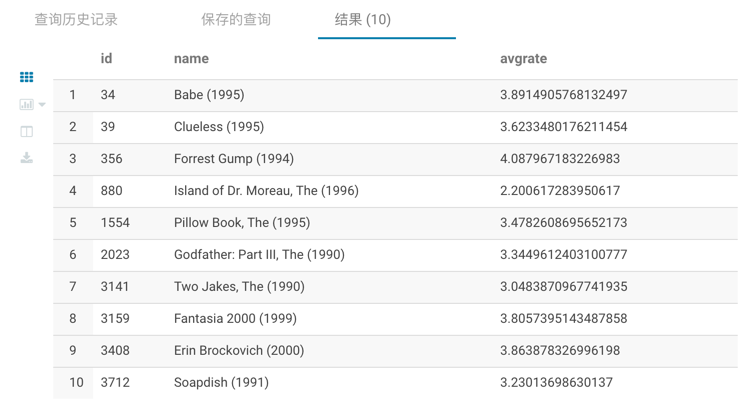

## Hive

### 题目一
简单展示电影ID为2116这部电影各年龄段的平均影评分

```roomsql
SELECT u.age, avg(r.rate) as avgrate
FROM t_rating as r LEFT JOIN t_user as u
WHERE r.movieid = 2116 and r.userid = u.userid GROUP BY u.age
```
**运行结果：**


### 题目二
找出男性评分最高且评分次数超过50次的10部电影，展示电影名、平均评分和评分次数

```roomsql
SELECT ru.sex as sex,m.moviename as name,ru.avg_rate as avgrate,ru.rate_count as total 
FROM t_movie as m
JOIN (SELECT u.sex,r.movieid,count(r.rate) as rate_count,avg(r.rate) as avg_rate
    FROM t_rating as r 
    LEFT JOIN t_user as u
    ON r.userid = u.userid 
    WHERE u.sex = 'M'
    GROUP BY u.sex,r.movieid) ru
ON m.movieid = ru.movieid 
WHERE ru.rate_count > 50
ORDER BY avgrate DESC
LIMIT 10
```
**运行结果：**
!

### 题目三
找出影评次数最多的女士所给出的最高分的10部电影的平均评分，展示电影名和平均评分。
```roomsql
SELECT res3.movieid AS ID,res3.moviename AS name,AVG(r2.rate) AS avgrate
FROM t_rating as r2
INNER JOIN
    (SELECT m.movieid,m.moviename
    FROM t_movie AS m
    INNER JOIN  -- 评分最高的10部电影
        (SELECT r1.movieid,r1.rate
        FROM t_rating AS r1
        INNER JOIN --影评次数最多的女性
            (SELECT r.userid,COUNT(r.rate) as count_r
            FROM t_user AS u
            INNER JOIN t_rating as r
            ON u.userid = r.userid
            WHERE u.sex = 'F'
            GROUP BY r.userid
            ORDER BY count_r DESC
            LIMIT 1) res1
        ON r1.userid = res1.userid
        ORDER BY r1.rate DESC
        LIMIT 10) res2
    ON res2.movieid = m.movieid) res3
ON res3.movieid = r2.movieid
GROUP BY res3.movieid,res3.moviename
```
**运行结果：**
